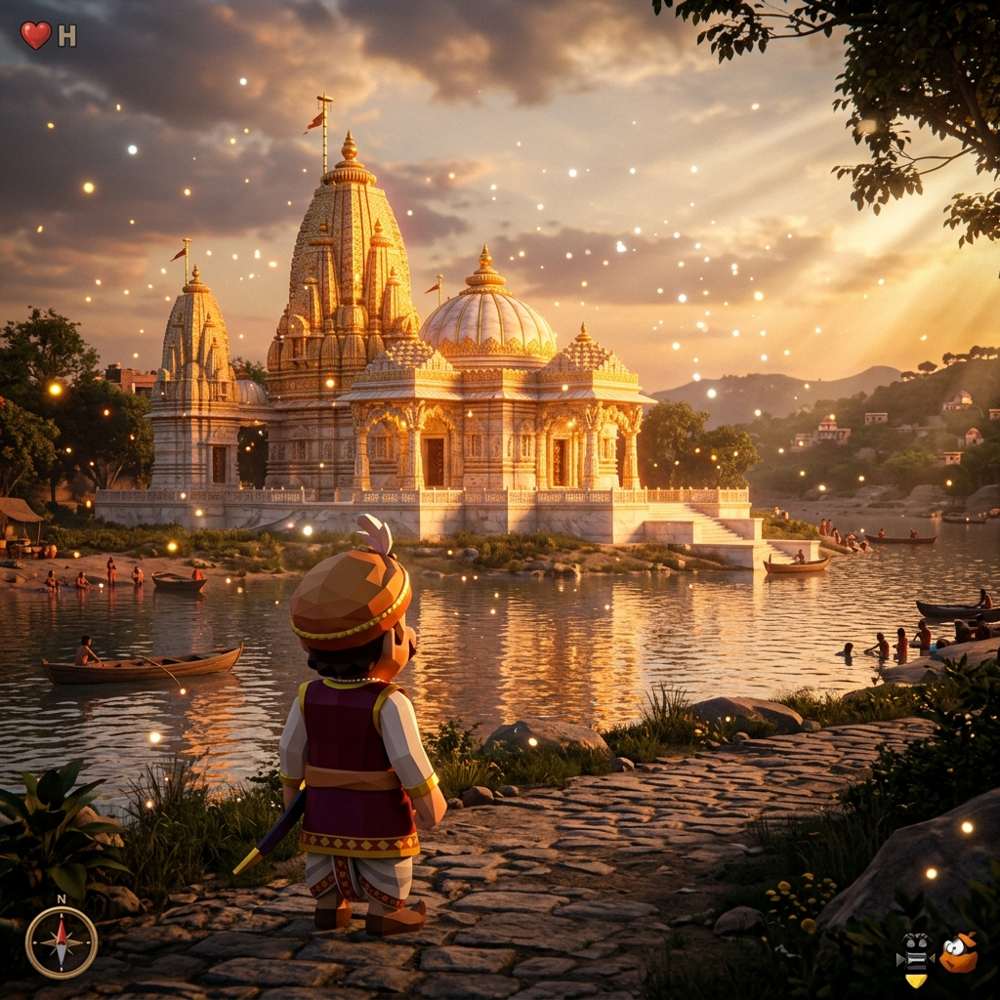
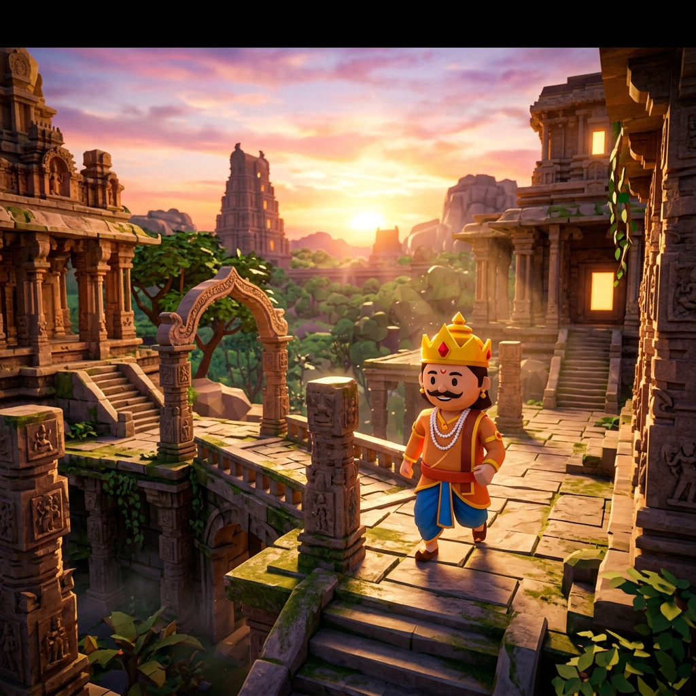

<div align="center">

# 👑 Maharaja's Bharat Odyssey



**An Open-Source, Photorealistic 3D Platformer built on Real-World OpenStreetMap Data.**<br>
Explore the majestic 16th-Century Empires of India directly in your browser or Android device.

[](https://github.com/virahitvin8/maharaja-bharat-odyssey/blob/main/LICENSE)
[](#)
[](#)
[](#)
[](#)
[](#)

[Play the Web Version Now](https://virahitvin8.github.io/maharaja-bharat-odyssey) • [Android Setup Guide](#android-play-store-build) • [Technical Architecture](#technical-architecture)

</div>

---

## 🌟 The Vision

*Maharaja's Bharat Odyssey* is a technical marvel that bridges the gap between procedural open-world generation and real-world geographic data. By integrating the **Overpass API**, the game dynamically streams actual buildings, roads, temples, and rivers from the modern world, re-texturing them into breathtaking **16th-century architectural styles**.

Experience the thrill of a classic 3D platformer (inspired by *Super Mario 64*) infused with the visual fidelity of modern post-processing (SSAO, Bloom, Atmospheric Scattering) and an emotionally resonant, procedural *Genshin Impact*-style soundtrack synthesized entirely via the Web Audio API.

---

## 📸 Gameplay & Visuals

<div align="center">
  
  <p><em>Exploring the ancient stone ruins of Hampi (Vijayanagara Empire) with cinematic Post-Processing and Raytraced-style lighting.</em></p>
</div>

### Features
- **Real-World Topography**: Every building, temple, and road you walk on is 1:1 scale with real geographic data.
- **Offline 16th-Century Cities**: Travel between historical empires (Vijayanagara, Kashi, Agra, Pataliputra, Madurai) with zero API limits, thanks to heavily optimized, pre-compiled JSON chunks.
- **Advanced Post-Processing**: Includes Screen-Space Ambient Occlusion (N8AO), high-quality Bloom, Temporal Anti-Aliasing (SMAA), and ACES Filmic Tone Mapping.
- **Procedural Audio Engine**: Zero MP3 bloat. The entire soundtrack (Indian Flute/Bansuri, ambient pads, and dynamic weather sounds) is calculated using pure mathematics via the Web Audio API.

---

## 🛠️ Technical Architecture

<div align="center">
  
</div>

The engine is built for **Fixed Capacity** environments, ensuring it runs at 60 FPS on mid-range Android devices without thermal throttling or crashing due to API limits.

1. **The Data Pipeline**: OpenStreetMap data is pre-fetched using `fetch-cities.js` to avoid the Overpass API rate limits during live gameplay.
2. **The Geometry Pipeline**: `@react-three/fiber` extrudes the 2D polygon footprints into 3D meshes instantly.
3. **The Physics Pipeline**: `@react-three/rapier` automatically wraps the generated world in rigid bodies, allowing the character to collide perfectly with real-world structures.
4. **The Rendering Pipeline**: Cinematic shaders (`RealisticWater`, `AtmosphereParticles`, `SimpleTree`) inject AAA aesthetics on top of the raw geometry.

---

## 🚀 Quick Start (Web Development)

1. **Clone the repository:**
   ```bash
   git clone https://github.com/virahitvin8/maharaja-bharat-odyssey.git
   cd maharaja-bharat-odyssey
   ```
2. **Install dependencies:**
   ```bash
   npm install --legacy-peer-deps
   ```
3. **Start the development server:**
   ```bash
   npm run dev
   ```
4. **Open your browser:** `http://localhost:5173/`

---

## 📱 Android Play Store Build

This project is fully integrated with **Capacitor**, meaning you can compile the entire React/Three.js engine into a native Android `.aab` file for the Google Play Store.

1. **Build the production web assets:**
   ```bash
   npm run build
   ```
2. **Sync the assets to the Android project:**
   ```bash
   npm run android:sync
   ```
3. **Open Android Studio:**
   ```bash
   npm run android:open
   ```
4. From Android Studio, you can generate a Signed APK/Bundle to upload to the Play Store!

---

<div align="center">
  
</div>

<div align="center">
  <b>Built with ❤️ by Neelam Akshit Vinay</b>
</div>
